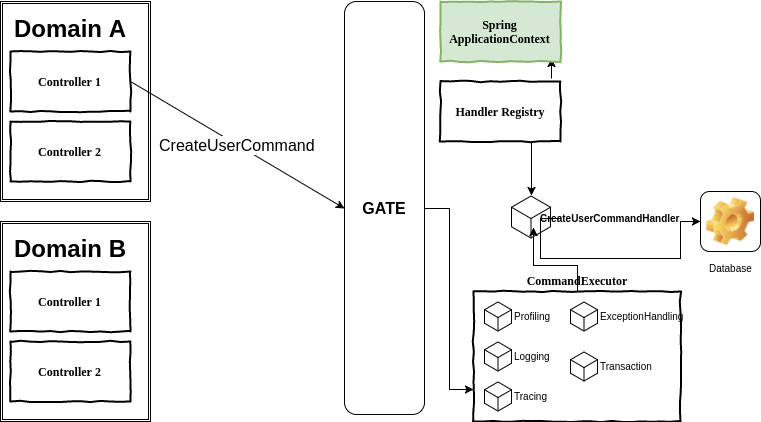

# spring-cqrs-arch

# WIKI

The WIKI contains the up-to-date documentation of the framework. Please check there for the configuration, the tutorial and other topics.

* 1.0.1 : Fixed a bug in the insertAfter step of a Workflow

* 1.0.0 : brand new concept to execute a commmand using a so-called Workflow. 

* 0.8.0 : refactor the command execution listener to allow storing informations in the command runner.

* 0.7.0 : Better integration with Spring Boot

https://github.com/sleroy/spring-cqrs-arch/wiki

# Purpose

This module is an implementation of a software architecture model inspired from the CQRS ( [link from Fowler](https://martinfowler.com/bliki/CQRS.html) ) model.

The idea is the following : the software functionalities are split between the read and the write accesses made by the user.

## Advantages

The strongest advantages of this architecture are - according my experience - :

* **Evolutive architecture** : this sofware architecture model enforces several OOP architecture principles (design patterns, transverse functionalities)
* **Easy testing** : the module and the architecture allows the developer to do unit-testing or component-based testing of its code. Furthermore this implementation is also providing out of the box : logging, profiling and tracing (file export) to push the debugging further
* **Spring compatible** : this architecture is compatible with IOC, Java and Spring
* **Microservice compatible** : this module can be used to implement a monolith and split it as microservices later, or directly as microservices if you implement a Bus.

## Cleancode

Some bad smells often found in Spring / Java 
Web applications are avoided with this model.

By instance : 
* **God / Mother classes** : Some years ago, it was quite common to find Java classes also known as Services containing quite a bunch of methods, a big grape of autowired services and poorly tested. These classes were highly fragile, hard to mock and test. By creating a class per command and therefore by usecase, the java classes are fine-grained,easier to mock and test.
* **Excessive parameters** The developer has to encapsulate the data into an Command object to pass it through the gate. This way, the OOP is enforced into the Core of this model.

Implementation model for an web application using CQRS principles.

## Scope

This module is offering basically the Command architecture principles, and a way to send events.

For the query part, I recommend a progressive approach :

- Use the same database and the same database access technology (with ORM)
- Use another database access technology (without ORM or NoSQL)

Credits and thanks here : [Wiki](https://github.com/sleroy/spring-cqrs-arch/wiki/References-and-Credits)
